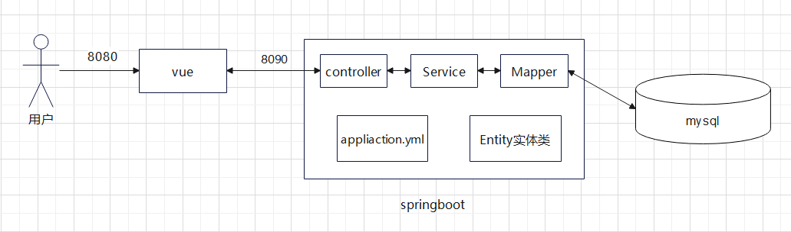
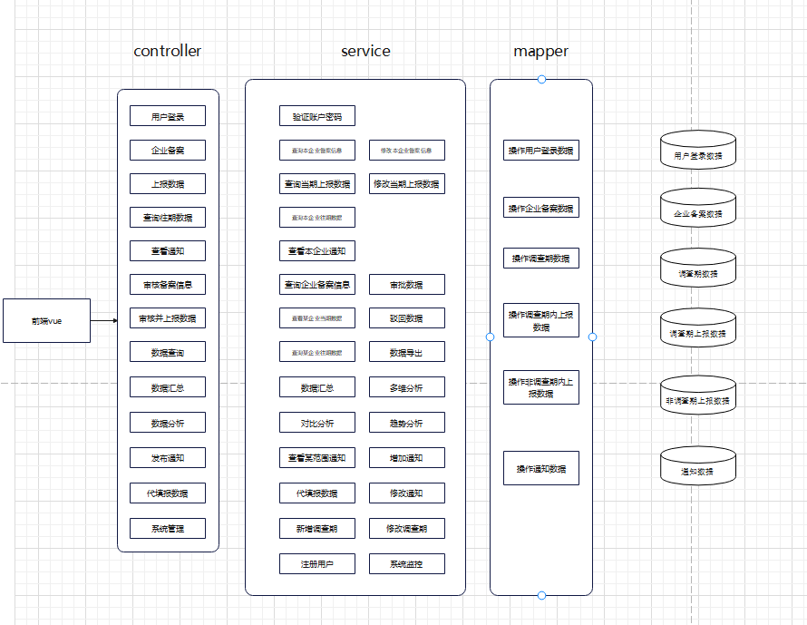
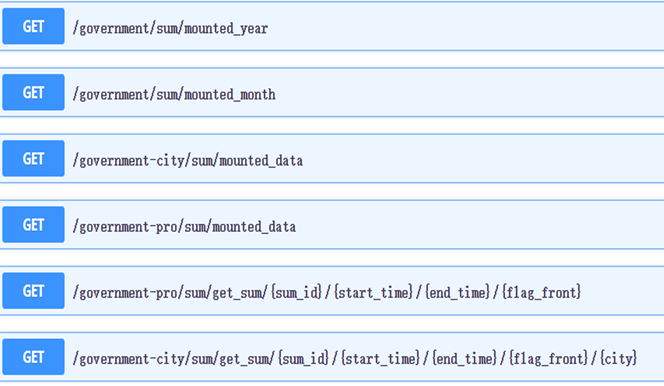
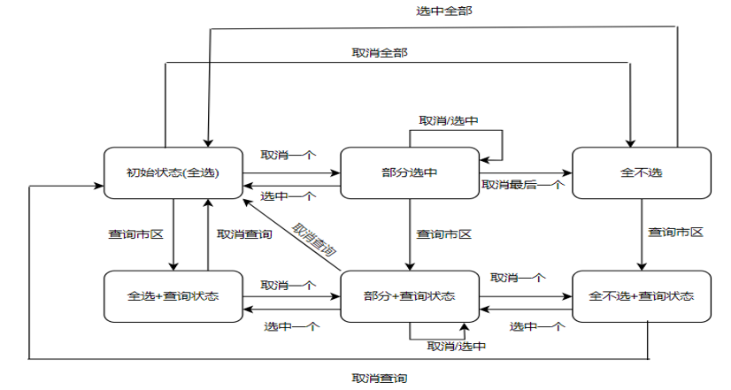
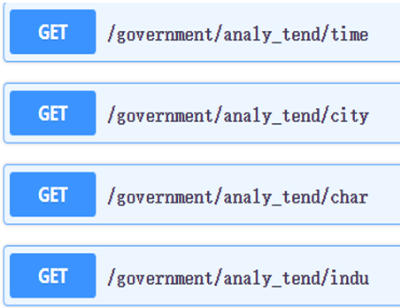
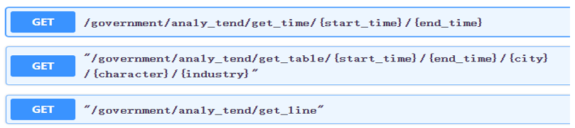
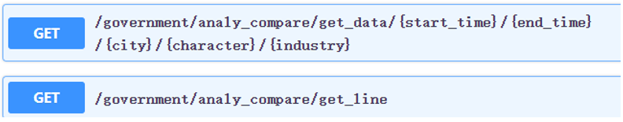

# 详细设计文档

### 目录

一、框架设计

二、项目体系结构

三、详细接口设计

### 一、框架设计

采用 vue + springboot + mysql的框架

| 使用技术   | 相关版本                                                     |
| ---------- | ------------------------------------------------------------ |
| vue        | 使用vue2 npm：9.8.1 vue/cli：5.0.8 element-ui：2.15.14 其余部件版本可见 仓库`\src\ui\vue-test\`目录下`package-lock.json`文件 |
| springboot | springboot：2.2.2 jdk：1.8 maven: 3.8.8 其余部件版本可查看仓库`\src\server\yunnan\pom.xml`文件 |
| mysql      | 8.0.35                                                       |

### 二、项目体系架构

前端 到 后端 到 数据库

### 三、详细接口设计

### 前端设计

####  1.路由架构和布局设计（wyx）

#####    路由设计	

- 路由界面：路由父界面包括登录界面，省界面，市界面和企业界面，通过在登录界面输入账号可以跳转到不同的界面，其中省界面，市界面和企业界面包含一系列子界面来实现系统的功能

- 路由守护：

        1. 通过路由守护防止恶意用户通过url直接进入用户界面，保证页面的进入只能通过输入密码实现，提升系统的安全性
        2. 实现页面标题的切换，不同的界面具有不同的标题，方便用户区分界面，提升用户体验

#####    布局设计

页面布局分为三部分：顶栏，侧边导航栏和主页面，其中顶栏可以显示用户信息，侧边栏可以实现不同页面的跳转，主页面显示系统功能的具体页面

####  2.具体界面设计（所有人）

- #### **汇总界面**

  - **组件设计**

    ###### 按钮组件：

    ​	1.汇总按钮:默认禁用，当且仅当选项的起始时间小于等于结束时间时激活

    ​	2.导出按钮:点击可以导出图表

    ###### 表格组件：

    ​	1.当前调查期就业表格:用户进入页面后直接显示

    ​	2.汇总数据表格 :用于展示汇总的数据，表头包括汇总项和就业人数 

    选项框组件

    ​	1.汇总字段选项框:调查期，企业性质，所属行业，企业地区，企业月度，企业季度，企业年度

    ​	2.起止调查期选项框组件:当汇总字段为调查期，企业性质，所属行业，企业地区时显示，具有匹配功能

    ​    3.起止月份组件:当汇总字段为企业月度和企业季度时显示

    ​    4.起止年份组件:当汇总字段为企业年度时显示

  - **接口设计**

  

- #### 取样分析界面

  - ##### 组件设计

    ###### 表格组件：

    ​     1.多选表2.饼状图

    ###### 选项框组件

    ​     1.市区选项框：选择后会改变表格显示，不会改变饼状图的数据

  - **接口设计**

    

  - ##### 状态转换图

    

- #### 图表分析界面

  - **组件设计**

    ###### 按钮组件：

    ​     1.查询按钮:默认禁用，当且仅当选项的起始时间小于结束时间时激活

    ​     2.导出按钮:默认禁用，当且仅当从后台有效数据时激活

    ###### 表格组件：

    ​    1.表格:显示对应企业在起止调查期内的就业人数变化占比(趋势)，对应企业在AB调查期和建档期的变化    				对比(对比)

    ​    2.折线图:显示企业在起止调查期内的岗位变化曲线(趋势)，AB调查期和建档期的岗位总数变化(对比)

    ###### 选项框组件

    ​     1.起止调查期选项框组件:选项格式20XX年XX月第X号调查期

    ​     2.地区选项框，企业性质选项框，所属行业选项框：所有选项均从后台获取

  - **接口设计**

    公用接口

    ​	

    趋势分析接口

    

    对比分析接口

    

- ​               		

##### 	

​		

### Contorller设计

##### 用户登录 `login.java`

##### 数据汇总`sum_data.java`

- 页面渲染时数据获取（函数输入值均为空）

  - /government-pro/sum/years

    描述:获取年份选项框数据

    返回类型和返回值：

    | 返回类型名称 | 返回类型                   | 说明     |
    | ------------ | -------------------------- | -------- |
    | years        | List<CompareMountedEntity> | 年份list |

  - /government-pro/sum/months

    描述:获取月份选项框数据

    返回类型和返回值：

    | 返回类型名称 | 返回类型                   | 说明     |
    | ------------ | -------------------------- | -------- |
    | months       | List<CompareMountedEntity> | 年份list |

  - /government-pro/sum/mounted

    描述:获取当前调查期就业数据

    返回类型和返回值：

    | 返回类型名称 | 返回类型               | 说明               |
    | ------------ | ---------------------- | ------------------ |
    | data_mounted | List<SumMountedEntity> | 当前调查期数据list |

- 省市数据汇总

  - /government-pro/sum

    输入类型和输入值：

    | 参数名称   | 参数类型 | 参数说明           |
    | ---------- | -------- | ------------------ |
    | sum_id     | String   | 汇总字段           |
    | start_time | String   | 开始时间           |
    | end_time   | String   | 结束时间           |
    | flag_front | String   | 前端时间选项框类型 |

    返回类型和返回值：

    | 返回类型名称 | 返回类型           | 说明         |
    | ------------ | ------------------ | ------------ |
    | sum_res      | List<SumResEntity> | 汇总数据列表 |

  - /government-city/sum

    输入类型和输入值：

    | 参数名称   | 参数类型 | 参数说明           |
    | ---------- | -------- | ------------------ |
    | sum_id     | String   | 汇总字段           |
    | start_time | String   | 开始时间           |
    | end_time   | String   | 结束时间           |
    | city       | String   | 所在市区           |
    | flag_front | String   | 前端时间选项框类型 |

    返回类型和返回值：

    | 返回类型名称 | 返回类型           | 说明         |
    | ------------ | ------------------ | ------------ |
    | sum_res      | List<SumResEntity> | 汇总数据列表 |

##### 企业备案 `companyinfo_submit.java`

+ 提交企业备案信息
路由：`/record`分配给`CompanyInfo_service`

     + 输入类型和输入值：

        | 参数名称 | 参数类型 | 参数说明               |
        | -------- | -------- | ---------------------- |
        | user_id      | String   | 用户名 |
        | company_name      | String   | 企业名称 |
        | company_id      | String   | 组织机构代码 |
        | city      | String   | 企业所在城市 |
        | district      | String   | 企业所属区 |
        | phone      | String   | 联系电话 |
        | company_character      | String   | 企业性质 |
        | company_industry      | String   | 所属行业 |
        | company_business      | String   | 主要经营业务 |
        | linksman      | String   | 联系人 |
        | linaddress      | String   | 联系地址 |
        | post_num      | String   | 邮政编码 |
        | fax_num      | String   | 传真 |
        | email      | String   | EMAIL |

    + 返回类型和返回值：

        | 参数名称            | 参数类型 | 参数说明                   |
        | ------------------- | -------- | -------------------------- |
        | result           | String   | 返回备案提交结果         |

##### 企业就业信息上报 `data_collection.java`

- 查询当期上报数据 
  路由： `/get_company_cedata`       分配给 `Get_company_cedata_service`

  - 输入类型和输入值：

    | 参数名称 | 参数类型 | 参数说明               |
    | -------- | -------- | ---------------------- |
    | cid      | String   | 待查询企业当前期的数据 |

  - 返回类型和返回值：

    | 参数名称            | 参数类型 | 参数说明                   |
    | ------------------- | -------- | -------------------------- |
    | companyID           | String   | 查询信息的企业ID号         |
    | docEmploymentNumber | int      | 企业建档期就业人数         |
    | curEmploymentNumber | int      | 企业调查期就业人数         |
    | numDecreasedReason  | int      | 人数减少原因               |
    | mainReason          | int      | 主要原因                   |
    | secondReason        | int      | 次要原因                   |
    | reasonDetail        | String   | 原因解释                   |
    | status              | int      | 状态码，表示当前的备案状态 |

- 修改当期上报数据 
  路由：`/modify_company_cedata`     分配给 `Modify_company_cedata_service`

  - 输入类型和输入值：

    | 参数名称            | 参数类型 | 参数说明                   |
    | ------------------- | -------- | -------------------------- |
    | cid                 | String   | 每一个操作必带的cid号      |
    | companyID           | String   | 要修改信息的企业ID号       |
    | docEmploymentNumber | int      | 企业建档期就业人数         |
    | curEmploymentNumber | int      | 企业调查期就业人数         |
    | numDecreasedReason  | int      | 人数减少原因               |
    | mainReason          | int      | 主要原因                   |
    | secondReason        | int      | 次要原因                   |
    | reasonDetail        | String   | 原因解释                   |
    | status              | int      | 状态码，表示当前的备案状态 |

  - 返回类型和返回值：

    | 参数名称 | 参数类型 | 参数说明 |
    | -------- | -------- | -------- |
    | result   | String   | 操作结果 |

##### 查询往期数据

##### 查看通知 `company_notice.java`

- 查看特定的一条通知 

  路由： `/get_company_notice`       分配给 `Get_company_notice_service`

  + 输入类型和输入值：

    | 参数名称  | 参数类型 | 参数说明 |
    | --------- | -------- | -------- |
    | companyID | String   | 企业ID号 |
    | noticeID  | String   | 通知ID号 |

  + 输出类型和输出值：

    | 参数名称  | 参数类型 | 参数说明         |
    | --------- | -------- | ---------------- |
    | date      | String   | 发布日期         |
    | govmentID | String   | 发布通知的省ID号 |
    | title     | String   | 通知标题         |
    | content   | String   | 通知内容         |

##### 审核备案信息

##### 审核并上报数据

##### 数据查询

##### 取样分析`analy_sample.java`

- 获取分析数据

  路由：`/government-pro/sample/mounted`

  描述：在页面渲染时获取对应的数据

  - 输入类型和输入值：void

  - 返回类型和返回值

    | 返回类型名称 | 返回类型              | 说明             |
    | ------------ | --------------------- | ---------------- |
    | data_mounted | List<SampleResEntity> | 取样分析数据list |

##### 图表分析`analy_tend.java`和`analy_compare.java`

​	**1.共用接口**

- 获取选项框选项

  路由：`/government-pro/tend_compare/city`，`/government-pro/tend_compare/indu`,

  `/government-pro/tend_compare/char`

  描述：在页面渲染时获取选项框的选项

  - 输入类型和输入值：void

  - 返回类型和返回值

    | 返回类型名称         | 返回类型     | 说明               |
    | -------------------- | ------------ | ------------------ |
    | city\|\|char\|\|indu | List<String> | 对应的选项名称列表 |

- 获取数据	

  路由：`/government-pro/tend_compare/get_data`

  描述：在前端点击查询按钮时获取对应的数据

  - 输入类型和输入值：

    | 参数名称   | 参数类型 | 参数说明     |
    | ---------- | -------- | ------------ |
    | city       | String   | 企业所在市   |
    | start_time | String   | 开始时间     |
    | end_time   | String   | 结束时间     |
    | character  | String   | 企业性质     |
    | industry   | String   | 企业所属行业 |

  - 返回类型和返回值：void

**2.对比分析接口**

- 获取表格数据

  路由：`/government-pro/compare/get_tabledata`

  描述：根据获取的数据库数据来计算对应的表格数据

  - 输入类型和输入值：void

  - 返回类型和返回值：

    | 返回类型名称 | 返回类型                  | 说明             |
    | ------------ | ------------------------- | ---------------- |
    | table_data   | List<`Compare_tableData`> | 计算后的表格数据 |

  - 对象属性说明`Compare_tableData`

    - name：企业名称
    - A_num, B_num：A调查期和B调查期的数据
    - A_change_num，B_change_num：A调查期和B调查期相较于各自建档期就业人数的变化数
    - A_change_precent，B_change_precent：A调查期和B调查期相较于各自建档期就业人数的变化比
    - AB_change，AB_percent：A调查期和B调查期就业人数对比的变化数和变化占比

- 获取折线数据     

  路由：`/government-pro/compare/get_linedata`

  描述：根据获取的数据库数据来计算对应的折线数据

  - 输入类型和输入值：void

  - 返回类型和返回值：

    | 返回类型名称 | 返回类型                 | 说明             |
    | ------------ | ------------------------ | ---------------- |
    | line_data    | List<`Compare_lineData`> | 计算后的折线数据 |

  - 对象属性说明：`Compare_lineData`

    - time：调查期名称
    - num：该调查期的岗位总数

**3.趋势分析接口**

- 获取表格数据

  路由：`/government-pro/tend/get_tabledata`

  描述：根据获取的数据库数据来计算对应的表格数据

  - 输入类型和输入值：void

  - 返回类型和返回值：

    | 返回类型名称 | 返回类型               | 说明             |
    | ------------ | ---------------------- | ---------------- |
    | table_data   | List<`Tend_tableData`> | 计算后的表格数据 |

  - 对象属性说明`Tend_tableData`：

    - company_name：企业名称
    - time_list：该企业存在数据的调查期列表
    - table_percent_list：对应调查期相较于建档期就业人数变化比列表

- 获取折线数据   

  路由：`/government-pro/tend/get_linedata`

  描述：根据获取的数据库数据来计算对应的折线数据

  - 输入类型和输入值：void

  - 返回类型和返回值：

    | 返回类型名称 | 返回类型              | 说明             |
    | ------------ | --------------------- | ---------------- |
    | line_data    | List<`Tend_lineData`> | 计算后的折线数据 |

  - 对象属性说明`Tend_lineData`：

    - company_name：企业的名称
    - last_num_list：该企业的所有建档期的就业人数列表
    - now_num_list：该企业的所有调查期期的就业人数列表

- 获取时间数据

  路由：`/government-pro/tend/get_time`

  描述：获取对应的调查期列表，用于前端折线图的x轴名称

  - 输入类型和输入值：

    | 参数名称   | 参数类型 | 参数说明 |
    | ---------- | -------- | -------- |
    | start_time | String   | 开始时间 |
    | end_time   | String   | 结束时间 |

  - 返回类型和返回值：

    | 返回类型名称 | 返回类型       | 说明       |
    | ------------ | -------------- | ---------- |
    | time_list    | List<`String`> | 调查期列表 |

##### 发布通知

##### 代填报数据

##### 系统管理

### Service 设计

##### 将企业提交的备案信息插入数据库`CompanyInfo_service.java`

+ 方法一 cpinfo_submit
    + 输入参数表: 

        | 参数名称 | 参数类型 | 参数说明               |
        | -------- | -------- | ---------------------- |
        | user_id      | String   | 用户名 |
        | company_name      | String   | 企业名称 |
        | company_id      | String   | 组织机构代码 |
        | city      | String   | 企业所在城市 |
        | district      | String   | 企业所属区 |
        | phone      | String   | 联系电话 |
        | company_character      | String   | 企业性质 |
        | company_industry      | String   | 所属行业 |
        | company_business      | String   | 主要经营业务 |
        | linksman      | String   | 联系人 |
        | linaddress      | String   | 联系地址 |
        | post_num      | String   | 邮政编码 |
        | fax_num      | String   | 传真 |
        | email      | String   | EMAIL |

    + 返回类型和返回值

        | 参数名称 | 参数类型 | 参数说明 |
        | -------- | -------- | -------- |
        | result   | String   | 操作结果 |

    + 调用Mapper `Companyinfo_Mapper`

##### 获取某企业当期调查期的数据 `Get_company_cedata_service.java`

- 方法一 get_company_cedata_by_cid

  - 输入参数表: 

    | 参数名称 | 参数类型 | 参数说明               |
    | -------- | -------- | ---------------------- |
    | cid      | String   | 待查询企业当前期的数据 |

  - 返回类型和返回值

    | 参数名称            | 参数类型 | 参数说明                   |
    | ------------------- | -------- | -------------------------- |
    | companyID           | String   | 查询信息的企业ID号         |
    | docEmploymentNumber | int      | 企业建档期就业人数         |
    | curEmploymentNumber | int      | 企业调查期就业人数         |
    | numDecreasedReason  | int      | 人数减少原因               |
    | mainReason          | int      | 主要原因                   |
    | secondReason        | int      | 次要原因                   |
    | reasonDetail        | String   | 原因解释                   |
    | status              | int      | 状态码，表示当前的备案状态 |

  - 调用Mapper `Cedata_Operating_Mapper`

##### 修改某企业当期调查期的数据 `Modify_company_cedata_service.java`

- 方法一 modify_company_cedata_by_cid

  - 输入参数表: 

    | 参数名称            | 参数类型 | 参数说明                   |
    | ------------------- | -------- | -------------------------- |
    | cid                 | String   | 每一个操作必带的cid号      |
    | companyID           | String   | 要修改信息的企业ID号       |
    | docEmploymentNumber | int      | 企业建档期就业人数         |
    | curEmploymentNumber | int      | 企业调查期就业人数         |
    | numDecreasedReason  | int      | 人数减少原因               |
    | mainReason          | int      | 主要原因                   |
    | secondReason        | int      | 次要原因                   |
    | reasonDetail        | String   | 原因解释                   |
    | status              | int      | 状态码，表示当前的备案状态 |

  - 返回类型和返回值

    | 参数名称 | 参数类型 | 参数说明 |
    | -------- | -------- | -------- |
    | result   | String   | 操作结果 |

    + 调用Mapper `Cedata_Operating_Mapper`

##### 数据汇总服务`sum_databyTime_service.java`

- 方法一`compute_TimewithPeriod`

  描述：实现时间段自增的效果

  - 输入参数表: 

    | 参数名称 | 参数类型 | 参数说明                                               |
    | -------- | -------- | ------------------------------------------------------ |
    | time     | String   | 进行自增的时间，数据格式20xx0x0x（年，月，第几调查期） |
    | et       | String   | 终止时间，增加的时间不能超过终止时间                   |
    | bound    | char     | 调查期界限，用于判断最后一位的增加                     |

  - 返回类型和返回值

    | 返回类型名称 | 返回类型 | 说明           |
    | ------------ | -------- | -------------- |
    | time         | String   | 时间自增的结果 |

- 方法二`get_mounted_data`

  描述：获取当前调查期的数据

  - 输入参数表: void

  - 返回类型和返回值

    | 返回类型名称 | 返回类型               | 说明           |
    | ------------ | ---------------------- | -------------- |
    | data_mounted | List<SumMountedEntity> | 调查期数据list |

- 方法三`get_datafortime`

  描述：当汇总字段与时间相关时获取数据

  - 输入参数表

    | 参数名称 | 参数类型 | 参数说明           |
    | -------- | -------- | ------------------ |
    | st       | String   | 获取数据的开始时间 |
    | et       | String   | 获取数据的结束时间 |

  - 返回类型和返回值：void

- 方法四`get_dataforpro`

  描述：当汇总字段与时间相关时获取数据
  
  - 输入参数表
  
    | 参数名称 | 参数类型 | 参数说明                                       |
    | -------- | -------- | ---------------------------------------------- |
    | st       | String   | 获取数据的开始时间                             |
    | et       | String   | 获取数据的结束时间                             |
    | type     | int      | 属性字段类别：0-企业地区 1-企业性质 2-所属行业 |
  
  - 返回类型和返回值：void

- 方法五`sum_datafortime`

  描述：当汇总字段与时间相关时汇总数据，根据时间类型不同调用不同的汇总函数

  所调用的函数为：sum_dataforresearch()，sum_dataformonth()，sum_dataforquter()，               sum_dataforyear()

  - 输入参数表

    | 参数名称 | 参数类型 | 参数说明                                                |
    | -------- | -------- | ------------------------------------------------------- |
    | type     | int      | 时间字段类别：0-调查期 1-企业月度 2-企业季度 3-企业年度 |

  - 返回类型和返回值：void

- 方法六`sum_dataforpro`

  描述：当汇总字段与企业属性相关时汇总数据

  - 输入参数表：void
  - 返回类型和返回值：void

- 方法六`give_res`

  描述：将汇总结果传送给控制器

  - 输入参数表

    | 参数名称 | 参数类型 | 参数说明                             |
    | -------- | -------- | ------------------------------------ |
    | flag     | int      | 判断是按属性汇总还是按时间汇总       |
    | type     | int      | 当汇总是按时间汇总时，判断时间的类型 |

  - 返回类型和返回值

    | 返回类型名称 | 返回类型        | 说明         |
    | ------------ | --------------- | ------------ |
    | data_res     | List<SumEntity> | 汇总数据list |

##### 取样分析服务`analy_Sample_service`

- 方法一`get_data`

  描述：从数据库中获取所需数据

  - 输入参数表：void

  - 返回类型和返回值

    | 返回类型名称 | 返回类型              | 说明             |
    | ------------ | --------------------- | ---------------- |
    | data_res     | List<SampleResEntity> | 取样分析数据list |

##### 趋势分析服务`analy_tend_service`

- 方法一`get_time`

  描述：从数据库中获取符合条件的调查期列表

  - 输入参数表：

    | 参数名称   | 参数类型 | 参数说明 |
    | ---------- | -------- | -------- |
    | start_time | String   | 开始时间 |
    | end_time   | String   | 结束时间 |

  - 返回类型和返回值

    | 返回类型名称 | 返回类型       | 说明       |
    | ------------ | -------------- | ---------- |
    | time_list    | List<`String`> | 调查期列表 |

- 方法二 `get_table`

  描述：根据从数据库中获取的数据计算前端表格数据

  - 输入参数表：void

  - 返回类型和返回值

    | 返回类型名称 | 返回类型               | 说明             |
    | ------------ | ---------------------- | ---------------- |
    | table_data   | List<`Tend_tableData`> | 计算后的表格数据 |

- 方法三`get_line`

  描述：根据从数据库中获取的数据计算前端折线数据

  - 输入参数表：void

  - 返回类型和返回值

    | 返回类型名称 | 返回类型              | 说明             |
    | ------------ | --------------------- | ---------------- |
    | line_data    | List<`Tend_lineData`> | 计算后的折线数据 |

##### 对比分析服务`analy_compare_service`

- 方法一`get_table`

  描述：根据从数据库中获取的数据计算前端表格数据

  - 输入参数表：void

  - 返回类型和返回值

    | 返回类型名称 | 返回类型                  | 说明             |
    | ------------ | ------------------------- | ---------------- |
    | table_data   | List<`Compare_tableData`> | 计算后的表格数据 |

- 方法二`get_line`

  描述：根据从数据库中获取的数据计算前端折线数据

  - 输入参数表：void

  - 返回类型和返回值

    | 返回类型名称 | 返回类型                 | 说明             |
    | ------------ | ------------------------ | ---------------- |
    | line_data    | List<`Compare_lineData`> | 计算后的折线数据 |

### Mapper设计

##### Cedata_Operating_Mapper

- 操作当前调查期的数据库

##### Sum_data_Mapper

- 操作的数据表：企业信息数据表company_info, 调查期索引数据表research_schedule，

  ​							调查期数据表data_20xx_09_1

- 接口：

  - `get_data`：

    描述：获取对应调查期数据表中的就业人数数据

    输入参数表：

    | 参数名称    | 参数类型 | 参数说明                           |
    | ----------- | -------- | ---------------------------------- |
    | timeTableId | String   | 调查期的名称，格式为data_20xx_09_1 |

    返回类型和返回值：

    | 返回类型        | 说明             |
    | --------------- | ---------------- |
    | List<SumEntity> | 就业人数数据列表 |

  - `get_datawithpro_XXX`:

    描述：XXX为不同的属性汇总字段，根据调查期获取对应字段的汇总数据，该类型的接口总共有三种

    输入参数表：

    | 参数名称    | 参数类型 | 参数说明                           |
    | ----------- | -------- | ---------------------------------- |
    | timeTableId | String   | 调查期的名称，格式为data_20xx_09_1 |

    返回类型和返回值：

    | 返回类型        | 说明             |
    | --------------- | ---------------- |
    | List<SumEntity> | 就业人数数据列表 |

  - `get_timemounted`:

    描述：获取调查期索引数据表中的所有调查期名称和调查期类型，该接口返回的结果主要用于计算月份list

    输入参数表：void

    返回类型和返回值：

    | 返回类型           | 说明       |
    | ------------------ | ---------- |
    | List<TimeidEntity> | 调查期list |

  - `get_datamounted`:

    描述：获取当前调查期的企业信息和就业人数

    输入参数表：

    | 参数名称    | 参数类型 | 参数说明                           |
    | ----------- | -------- | ---------------------------------- |
    | timeTableId | String   | 调查期的名称，格式为data_20xx_09_1 |

    返回类型和返回值：

    | 返回类型               | 说明                           |
    | ---------------------- | ------------------------------ |
    | List<SumMountedEntity> | 对应调查期的企业信息和就业人数 |

##### Analy_sample_Mapper

- 操作的数据库表格：企业信息表company_info

- 接口

  - `get_data`

    描述：获取企业信息表中的企业数据并通过聚合函数根据city属性分类计算数量

    输入参数表：void

    返回类型和返回值：

    | 返回类型                  | 说明                         |
    | ------------------------- | ---------------------------- |
    | List<Map<String, String>> | 经过聚合函数计算后的表格数据 |

##### Analy_compare_Mapper

- 操作的数据库表格：企业信息数据表company_info, 调查期数据表data_20xx_09_1

- 接口

  - `get_data`

    描述：从企业信息表和调查期数据表中获取符合条件的企业就业数据

    输入参数表：

    | 参数名称    | 参数类型 | 参数说明                           |
    | ----------- | -------- | ---------------------------------- |
    | timeTableId | String   | 调查期的名称，格式为data_20xx_09_1 |
    | city        | String   | 企业所在城市                       |
    | industry    | String   | 企业所属行业                       |
    | character   | String   | 企业性质                           |

    返回类型和返回值：

    | 返回类型                 | 说明                     |
    | ------------------------ | ------------------------ |
    | List<TendCompare_Entity> | 对应调查期的企业就业人数 |

  - `get_mounted_city`

    描述：从企业信息表中查询所有不同的市名称

    输入参数表：void

    返回类型和返回值：

    | 返回类型     | 说明       |
  | ------------ | ---------- |
    | List<String> | 市名称列表 |

  - `get_mounted_char`

    描述：从企业信息表中查询所有不同的性质名称

    输入参数表：void

    返回类型和返回值：
  
    | 返回类型     | 说明         |
    | ------------ | ------------ |
    | List<String> | 性质名称列表 |
  
  - `get_mounted_indu`
  
    描述：从企业信息表中查询所有不同的行业名称
  
    输入参数表：void
  
    返回类型和返回值：
    
    | 返回类型     | 说明         |
    | ------------ | ------------ |
    | List<String> | 行业名称列表 |

##### Analy_tend_Mapper

- 操作的数据库表格：企业信息数据表company_info, 调查期数据表data_20xx_09_1

- 接口

  - `get_data`

    描述：与对比分析复用同一接口

  - `get_resname`

    描述：从企业信息表中查询符合条件的企业名称列表

    输入参数表：

    | 参数名称  | 参数类型 | 参数说明     |
    | --------- | -------- | ------------ |
    | city      | String   | 企业所在城市 |
    | industry  | String   | 企业所属行业 |
    | character | String   | 企业性质     |

    返回类型和返回值

    | 返回类型     | 说明                   |
    | ------------ | ---------------------- |
    | List<String> | 符合条件的企业名称列表 |
  
  - 其余获取企业信息的接口与对比分析共用

### Entity类设计

##### 1.Time_MountedEntity

​	描述：存放从调查期索引数据表获取的调查期数据或计算后的年月季度数据，可在多个Mapper中实现复用

​	属性：

- name:调查期或年月季度的名称
- id:list的id，方便前端选项框区分每个元素

##### 2.Sum_Entity

​	描述：存放从调查期数据表中获取的就业人数数据，且可以复用于汇总后的数据

​	属性：

- kind_name:汇总字段名称
- num:就业人数

##### 3.Sum_MountedEntity

​	描述：存放从调查期数据表中获取的就业人数数据和企业信息数据表获取的企业信息数据

​	属性：

- name:企业名称
- city:所属地区
- character:企业性质
- industry:所属行业
- time:所属调查期
- num:就业人数

##### 4.TendCompare_Entity

​	描述：存放从调查期数据表和企业信息表中获取的符合条件的企业就业人数数据和基本信息

​	属性：

- name:企业名称
- last_num:建档期就业人数
- now_num:调查期就业人数
- time:所属调查期

##### 5.SampleResEntity

​	描述：存放从企业信息表通过聚合函数查询计算出的市企业数量数据

​	属性：

- name:地级市的名称
- value:该市的企业数量

### 四、其它

有关功能设计、数据库数据设计、界面设计部分可以查看 [概要设计文档](./summaryDesign.md)